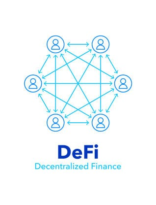
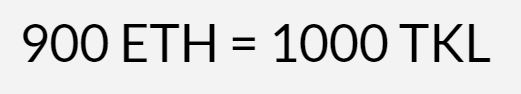
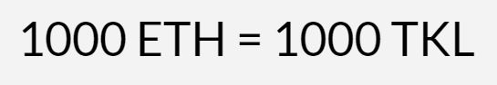

# EthereumBonds
## Issue Bonds in the Ethereum Blockchain

 

EthereumBonds is a decentralized application (dapp) that by deploying a solidity contract allows borrowers to issue a bond in the Ethereum blockchain, investors use the same dapp to buy the bonds and track payments. Investors buy the bonds (ERC20 tokens) and they get paid back principal and interest in equal monthly installments. The borrower selects the terms of the contract and investors decide whether to invests or not. The solidity contract used by the dapp is called TokenLoans. 

The borrower sells its bonds at a discount and has to buy them back at parity. 

### Sell Bonds at a Discount

In this example the borrower sells its bonds at a ratio of 900 to 1000 i.e. 900 Ether gives the investor 1000 bonds. 

 

### Redeem the Bonds at Parity

The borrower has to buy back the bonds at parity i.e. 1 bond gives back 1 Ether. The bonds produced by the contract have the same number of decimals (18) as Ether. 

 

The difference between the sell and buy price is the interest the investors make. In this example the investors get an interest of 11.11%. The borrower redeems the bonds in equal monthly installments. 

## What the Contract Cannot Do

* Force payment
* Schedule a payment 

Every solidity contract has these limitations. The Ethereum Virtual Machine does not offer a scheduling service and it cannot extract money from a private wallet. The contract, however, does provide two public variables that can be used to determine the health of the contract: the percentage paid to investors and whether the contract ended successfully (this boolean turns true if the investors were paid within the timeframe stated by the borrower).

## Required Fields

At the top there are two inputs: Contract address and signer private key. These two inputs are required for every transaction except for deployment when the borrower only needs their private key. 

## How to Deploy the Contract

The contract has 5 constructors:

 

1) Fundraising goal (ETH): The contract needs a fundraising goal. 
2) Discounted price for 1000 (ETB): How much will an investor pay for 1000 of the borrower's bonds? This will define the exchange rate the borrower is selling its tokens for. 1000 means that the investors get zero interest. We suggest a number between 950 (interest of 5.26%) and 800 (interest of 25%).
3) Maturity in months: How many equal monthly payments does the borrower want to make?
4) Number of fundraising days: If the time ends and the goal hasn't been reached investors can pull their money out. If the fundraising time hasn't ended the borrower can return the principal to investors. 
5) Grace period in months: number of months before the borrower has to start making payments. 

The wallet that deploys the contract becomes the owner. The contract address will appear in the corresponding input at the top. 

## Contract Info

At the bottom right of the page there is the field Contract Info. Everytime you interact with a contract the information will update to show the most current data. You don't have to be the owner of the contract, not even an investor in order to query the contract, anyone with a private key can do it. All the variables that were used as constructors and the owner of the contract are public. 

#### Contract Ended Successfully

 

The default value of this boolean is false. It turns true if all investors get paid within the timeframe specified by the borrower. 

#### Fundraising Ended

 

The default value of this boolean is false. It turns true when the fundraising goal is reached. 

#### Percentage Paid to Investors

 

Percentage of total tokens sold that have been refunded. This is usually 1% off due to lack of float type in solidity. 

#### Time

 

The contract timestamps three events: deployment of the contract, fundraising ends, payment to investors is complete. It is possible that one of the last two benchmarks is not met, in that case the value is zero. Like in all solidity contracts time is recorded as number of seconds since Jan 1st 1970.

#### Total Contract Funds and Total Supply

 

totalContractFundsinWei tells the user the total funds in the contract. Total supply is the number of tokens that are outstanding in the hands of investors. This example is from when a fundraising ended and no funds have been withdrawn, the borrower fundraised 250 ether, notice that the number of tokens is higher, the difference is the interest. 

#### Outstanding Tokens Minus Contract Funds

 

This variable tells the user the difference between the outstanding tokens and the contract funds. It helps the borrower know how much do they have to deposit in the contract to make the investors whole. 

## Main Functions

#### Buy TKL with Wei

 

 

This function is public and can only be called before the fundraising ends. The fundraising ends when the fundraising goal is reached. In conjunction with the value interface in Remix the investor uses this button to buy tokens, there is a check in the function that stops the investor from buying more tokens than allowed by the fundraising goal. The investor can check the number of tokens bought by clicking the balanceOfSender button. 

 

#### Make Monthly Payment

 

Only the owner can call this function after the fundraising ends. It takes the number of tokens sold and divides that between the number of monthly payments. It sends out a payment to investors proportional to the number of tokens they bought. It does not take into account possible early payments made by the borrower. 

#### Send Payment to Investors

 

Only the owner can call this function after the fundraising ends. It divides up the amount entered in the interface among investors proportional to the tokens they bought. It is not possible for the borrower to pick one particular investor to receive the payment. The contract does not penalize early payment. 

#### Withdraw Funds

 

Only the owner can call this function after the fundraising ends. The funds raised live in the contract, not in the owner's wallet. The owner has to use this function to withdraw funds.

#### Investor Refund Principal

 

Anyone can call this function if two conditions are true: the fundraising time has ended and the fundraising goal hasn't been reached. Investors get refunded without interest. 

#### Owner Refund Principal

 

Only the owner can call this fuction before the fundraising ends. Investors get refunded without interest.

#### Deposit

 

Only the owner can call this function after the fundraising ends. Investors get paid from the funds that are in the contract, the borrower has to deposit enought funds to make the payments. 

## Main Public Variables

