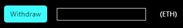

# EthereumBonds: Issue Bonds in the Ethereum Blockchain

 

EthereumBonds is a decentralized application (dapp) that by deploying a solidity contract allows borrowers to issue a bond in the Ethereum blockchain, investors use the same dapp to buy the bonds and track payments. Investors buy the bonds (ERC20 tokens) and they get paid back principal and interest in equal monthly installments. The borrower selects the terms of the contract and investors decide whether to invest or not. The solidity contract used by the dapp is called TokenLoans. 

The borrower sells its bonds at a discount and has to buy them back at parity. 

### Sell Bonds at a Discount

In this example the borrower sells its bonds at a ratio of 900 to 1000 i.e. 900 Ether gives the investor 1000 bonds. 

 

### Redeem the Bonds at Parity

The borrower has to buy back the bonds at parity i.e. 1 bond gives back 1 Ether. The bonds produced by the contract have the same number of decimals (18) as Ether. 

 

The difference between the sell and buy price is the interest the investors make. In this example the investors get an interest of 11.11%. The borrower redeems the bonds in equal monthly installments. 

## Enforcement

What the Contract Cannot Do:

* Force payment
* Schedule a payment 

Every solidity contract has these limitations. The Ethereum Virtual Machine does not offer a scheduling service and it cannot extract money from a private wallet. The contract, however, does provide two public variables that can be used to determine the health of the contract: the percentage paid to investors and whether the contract ended successfully (this Boolean turns true if the investors were paid within the timeframe stated by the borrower).

## Required Fields

At the top there are two inputs: Contract address and signer private key. These two inputs are required for every transaction except for deployment when the borrower only needs their private key. 

 

## How to Deploy the Contract

The contract has 5 constructors:

 

1) Fundraising goal (ETH): The contract needs a fundraising goal denominated in Ethereum. 
2) Discounted price for 1000 (ETB): How much will an investor pay for 1000 of the borrower's bonds? This will define the exchange rate the borrower is selling its tokens for. 1000 means that the investors get zero interest. We suggest a number between 950 (interest of 5.26%) and 800 (interest of 25%).
3) Maturity in months: How many equal monthly payments does the borrower want to make?
4) Number of fundraising days: If the time ends and the goal hasn't been reached investors can pull their money out. If the fundraising time hasn't ended the borrower can return the principal to investors. 
5) Grace period in months: number of months before the borrower must start making payments. 

The wallet that deploys the contract becomes the owner. The contract address will appear in the corresponding input at the top. 

## Contract Info

At the bottom right of the page there is the Contract Info field. Every time you interact with a contract the information will update to show the most current data. You don't have to be the owner of the contract, not even an investor in order to query the contract, anyone with a valid contract address and private key can do it. Enter these two variables in the corresponding fields at the top and click on "Get Info".

 

All the constructor variables and the owner of the contract are public. Below other the public variables:

* Contract Funds (ETH): The proceeds of the bond sale do not go directly to the borrower but rest within the contract itself. 

* Outstanding Bonds: Total number of bonds that haven't been redeemed yet. 

* Outstanding Bonds Minus Contract Funds: During the fundraising, the funds in the contract will be less than the number of bonds sold. The borrower will have to pay that difference which is the interest owed to investors.  

* Percentage paid to investors: Redeemed bonds divided by total bonds sold times 100. This is usually 1 percentage point off due to lack of float type in solidity, thus 99 means that investors were paid in full. 

* Time contract was deployed: This will populate immediatelly after deployment. Like in all solidity contracts time is recorded as number of seconds since Jan 1st 1970. 

* Time fundraising ended: If N/A the fundraising hasn't ended. 

* Time payment ended: If N/A the investors haven't been paid back yet. 

* Contract ended successfully?: This Boolean starts as false. It turns true if the borrower pays back the investors within the time stipulated in the contract. 

## Functions
There are basic frontend validations that will light up if the user is missing information. However, if the user enters an invalid contract address or private key they will be able to click on the buttons but the transaction will not be recorded. Similarly, if the user is trying to do actions not allowed by the contract, they will be able to click on the buttons but the transaction will not be recorded. The dapp does not have front end validations for every possible error scenario. The best way to test whether a transaction was recorded is by paying attention to the Contract Info section. You can have the console (dev tools) in your browser open to see what errors you are getting back from Ethereum. 

### Borrower Functions
The functions below can only be used under two conditions: the user is the contract owner and after the fundraising has ended. 

 

It will deposit in the contract a value equal to the variable "Outstanding bonds minus contract funds". After you click on it, "Outstanding bonds minus contract funds" will fall to zero. The funds to pay investors come out from the contract, not the borrower's wallet. 

 

The borrower can deposit any amount they want in the contract. 

 

This function will send a monthly payment to investors (redeem part of the bonds they hold). One payment is defined as total number of bonds sold divided by number of monthly payments, the payment will be divided among investors proportional to the bonds they hold. All investors get paid at the same time, it is not possible to single out one investor or to pay a different amount. For this function to work there must be enough funds in the contract to make one payment. This function allows to make early payments.

 

The funds raised from selling the bonds are stored in the contract. The borrower can use this function to withdraw all the funds from the contract. 

 

The funds raised from selling the bonds are stored in the contract. The borrower can use this function to withdraw any amount from the contract.

### Investor Functions

 

This function is valid only before the fundraising has ended. The contract won't let the investor buy more bonds than allowed by the fundraising goal. This function will automatically activate the function "How many bonds do I own?" displaying the total number of bonds owned by the investor. 

 

The investor can use this function to query how many bonds they own. 

 

Anyone can call this function (even if it is not the owner or an investor) if two conditions are true: the fundraising time ended and the fundraising goal wasn't reached. This function will give back the principal (without interest) to ***ALL*** investors. 

